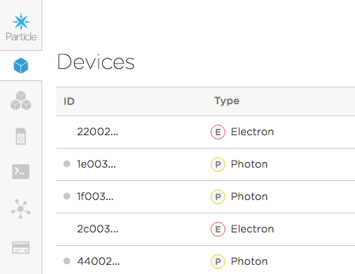
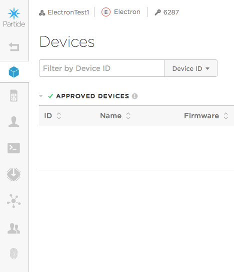
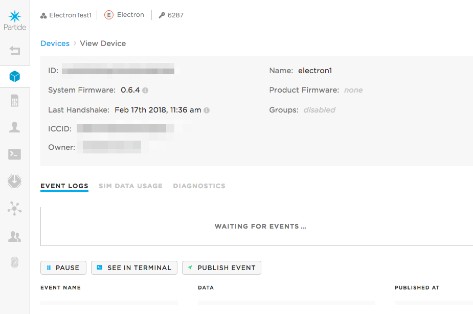
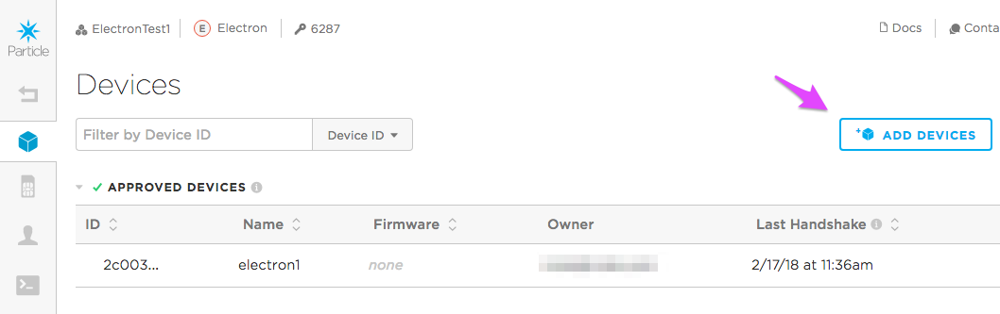
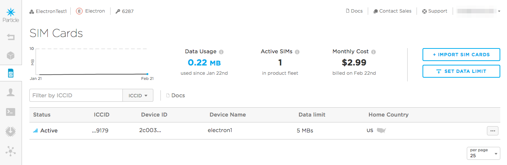
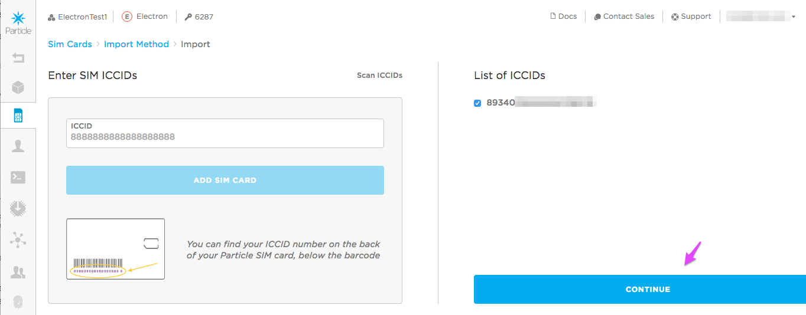
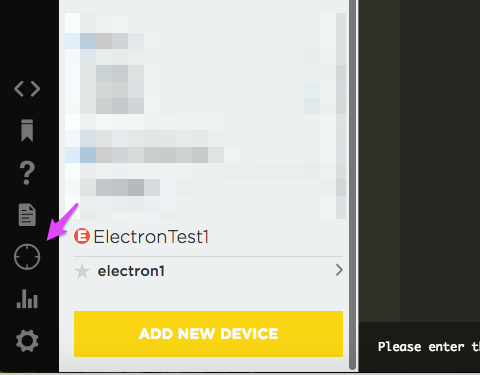
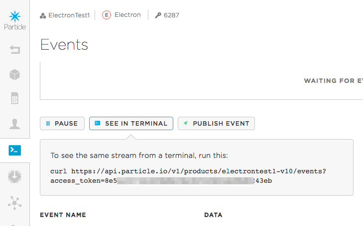

# Managing product Electrons

*Guide for transitioning from developer to product Electrons*

## Developer Electrons using setup.particle.io

The way most individual developers set up their first Electron is using [http://setup.particle.io](http://setup.particle.io). This actually does three things:

- Activate SIM
- Claim Electron
- Name Electron

This guide will explain a bit of how to transition to handling Electrons in bulk.

## The Basics

### SIMs and Electrons

SIMs are not tied to a specific Electron. You can swap Particle SIM cards between Electrons with no software or configuration changes. The cloud does remember the last SIM card that was used in the Electron, which is how it's displayed in your product view.

Likewise, products don't care if the SIM is registered to an individual user, or even another product. As long as there's an activated SIM, it will work.

### Claiming

All Particle devices requiring claiming, which associates a device with an account.

Photon/P1 Wi-Fi devices often use a more complicated product customer claiming system. This creates separate accounts for each customer.

This can also be used with Electrons, however many Electron products claim all of the devices to a company owned account, because individual customer accounts are not necessary for their application.

Basically, if you have a desire to interact with the device directly using a mobile app, then you probably want to use customers. 

If you are only ingesting data produced by Electrons, even if you provide a web interface, you may not need to claim devices to individual customers. You can separate out all of the data within your own back-end or web apps.

Remember: devices may be part of a product, but they are claimed to a specific account or customer as well.

### Developer SIM and Device Limits

Each account is limited to 100 non-product Electron devices and 100 SIM cards. 

Note that the limit is 100 non-product Electrons. This specifically allows the case where the company claims all of the product Electrons to their own account. It's not limited to 100 as long as the Electrons are also part of a product.

SIMs, however are still limited. So you'll want to make sure you activate the SIMs as product SIMs.

## Using the console

The important thing to remember about the console is that there are two sections, the developer account, and inside the product. Many options occur in both.

This is the developer page, and the icons below the Particle icon are:

- Devices
- Products
- SIMs
- Events
- Integrations
- Billing



Once you go into a product, you'll see many of the same options, but for the product.

- Devices
- SIMs
- Customers
- Events
- Firmware
- Integrations
- Team 
- Authentication



Also note that when you view a single device, there's another event view:



This is important because the views are not completely interchangeable. For example, when using integrations, the particle-internal events from your webhook only appear in the device owner's event log. They do not appear in the product or device event log.

### Adding device IDs a product (console)

The first step is usually to add the device IDs to your product. This is what determines whether the device can join your product or not. 

Note that this must be done in the devices tab within the product!



You can type in a single device ID (24 character hex), or include a whole file of device IDs.

When you order devices in tray or larger quantities from the wholesale store, you should get an email with the device IDs in your order. This saves a great deal of time over typing them in!

If you are only adding a few, the most common method is `particle identify` in the Particle CLI, but there are [dozens of ways to find your device ID](https://docs.particle.io/faq/particle-devices/finding-device-id/electron/).

### Import SIMs (console)

Instead of activating SIMs one-by-one using [setup.particle.io](https://setup.particle.io) you can import them in bulk as product SIMs.

Product SIMs are owned by your company and you are billed for all of the monthly charges and data usage. 

Make sure you do this from within your product!



You can:

- Scan ICCID cards using a webcam
- Type in one or more ICCIDs
- Upload a file

When you order bulk pack of 50 SIM cards from the Particle wholesale store, you should get a file containing all of the ICCIDs of the SIM cards in your order.

You can also use `particle identify` to get the ICCID of the SIM card in your Electron.

Note that importing SIMs is a two-step process! Don't forget to click the **Continue** button to actually import the SIMs. The operation won't be done until you continue on to the next page and set the country and data limits for the newly imported SIMs.



If you have SIMs in your developer account you can migrate them into your product without releasing ownership. Just do the import and they'll be moved.


### Claiming the device (build)

The first step, adding the device to your product, is only half the process. You still need to claim the device to your account, and optionally name it.

You can only claim a device to your account when it's online and breathing cyan, so make sure you do that first.

You can't claim a device from the console, but you can from the CLI or [Particle Build](https://build.particle.io). You can click the </> icon in the lower left corner of the console page to bring up build.

Use the Devices icon (circle with 4 lines) to bring up the devices tab and scroll to the bottom. Use the **Add New Device** button to add a new device.



Once added, you can also rename a device easily here by clicking on its name.

It's also easy to claim and rename devices from the Particle CLI, as described in the next section.


## Using the Particle CLI and curl

If you want to build an automated process, you may want to do so using a scripting language, leveraging tools like the Particle CLI and curl.

The two product steps using curl require a product access token. This is different than your account access token in build!

In the console, open your product, Events, then click **See in Terminal**.



Copy the access_token, it's everything after the equal sign to the end of the line. Note that when you close this console session this access token is invalidated.

### Adding device IDs a product (curl)

Adding device IDs to a product can be done using curl and a file containing the device IDs.

The example from [the documentation](https://docs.particle.io/reference/api/#import-devices-into-product) is:

```
$ curl "https://api.particle.io/v1/products/6287/devices?access_token=YOUR_ACCESS_TOKEN" -F file=@devices.txt
```

Remember to replace 6287 with your numeric product ID shown next to the key icon in the top of the console.

And replace YOUR\_ACCESS\_TOKEN with your product access token from the previous step.

### Import SIMs (curl)

The documentation includes a command to import SIMs but I could never get [that example](https://docs.particle.io/reference/api/#import-and-activate-product-sims) to work properly.

This one works, however. I created a file sims.txt containing the ICCIDs I wanted to import to my product.

```
curl -F file=@sims.txt -F country=US -H "Authorization: Bearer YOUR_ACCESS_TOKEN" https://api.particle.io/v1/products/6287/sims
```

Note that that's only a space after Bearer, not an equal sign like the import devices command.

And of course replace 6287 with your product ID.

And replace US with your country code if it's different.

### Claiming the device (CLI)

You can only claim devices when they are online and breathing cyan. It's easy to claim a device using the Particle CLI:

```
particle device add YOUR_DEVICE_ID
```

If you want to name your device you can do that too:

```
particle device rename YOUR_DEVICE_ID "NewName"
```


